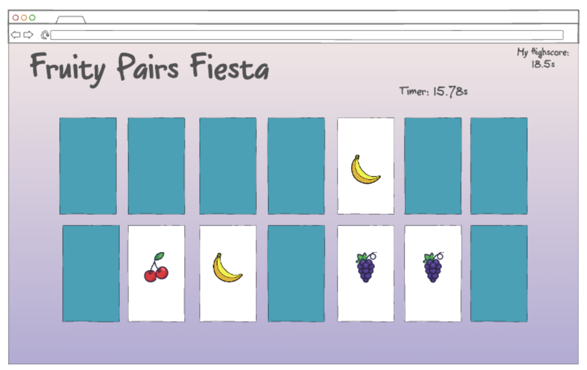
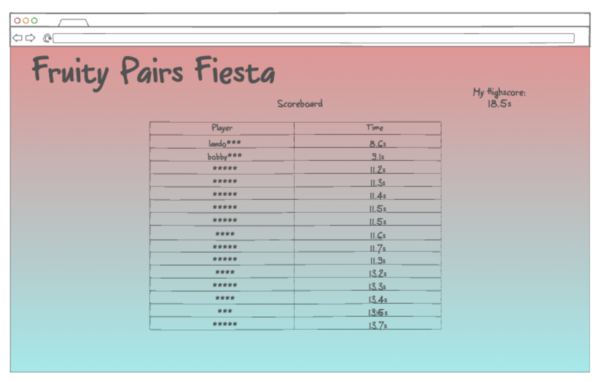

# Fruity Pairs Fiesta
startup application for CS 260
## Specification Deliverable
### Elevator Pitch
These days, it seems that kids' attention span is getting worse and worse with TV shows and games that provide constant stimulation. Fruity Pairs Fiesta is a memory exercise for kids that will strengthen their minds and sharpen their focus overall.
### Design

### Key Features
- Secure login over HTTPS
- Displays Leaderboard with live updates
- Stores individual best scores (lowest time)
### Technologies
I will use the following technologies in the following way:
- HTML - Used to create the game board and score display.
- CSS - Used to create the visuals so it is more visually appealing.
- Javascript - Provides login, handles interaction on the page, and game logic/processes such as timers.
- HTTPS - Enables secure login.
- DB - Stores login information and best scores.
- WebSocket Data - As users get better scores, the highest scores are. broadcasted on the leaderboards page live.